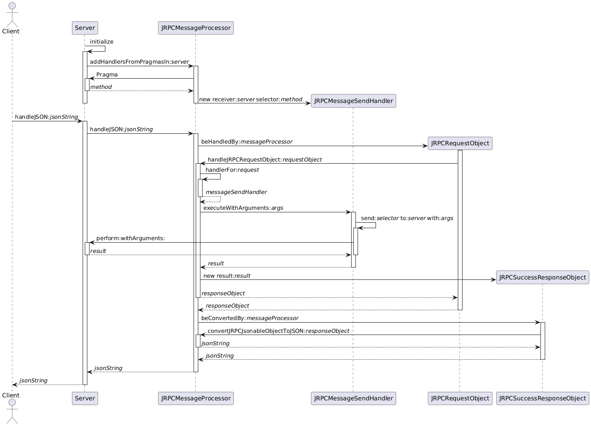

This is an implementation of a [Model Context Protocol](https://modelcontextprotocol.io/docs/getting-started/intro) server for Moose.
Using it, LLM clients can query a Moose model

The Pharo part does not actually implement the MCP protocol.
It implements only a JRCP server than answers to a python MCP server.
The python code is in the `pythonClient` directory (which is a *client* to the Moose JRCP server, but acts as a *MCP server* for the LLM :wink:)

# PythonClient

There two main files:
- `mooseMCPClient.py`: an end user tool that launchs a MCP server and a LLM;
- `mooseMCPServer.py`: a MCP server that forwards the LLM queries to the Moose server.
  Note that the Moose JRCP server must be started beforehand.

The overall interaction is the following:
- End User starts the Moose server. Moose must have a Famix model of a project.
- End User starts the `mooseMCPClient.py`
- `mooseMCPClient.py` starts the `mooseMCPServer.py` and the LLM
- `mooseMCPClient.py` asks for the list of "MCP tools" that the `mooseMCPServer.py` can offer.
  Each MCP tool is declared as a python function in the `mooseMCPServer.py` file and actually calls a method of the Moose server.
- `mooseMCPClient.py` registers the `mooseMCPServer.py` and the list of its MCP tools into the LLM
- `mooseMCPClient.py` starts an interaction loop with the user
  - End User asks a question
  - `mooseMCPClient.py` forwards the question to the LLM
  - LLM decide what MCP tool(s) it needs and calls it (them) in the `mooseMCPServer.py`
  - `mooseMCPServer.py` forwards the call(s) to the Moose JRCP server
  - answer is returned to the End User

# JRPC server

For reference, this is the UML sequence diagram of how a JRPC server works in Pharo:

